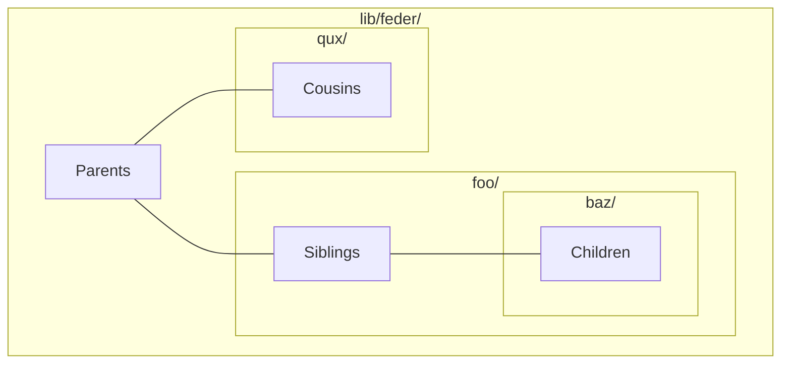

# Feder

Feder is a social journal where you can make private entries and 
selectively share them.

## Project structure

This project attempts to facilitate agile development in 
sacrifice of technical classification. 

### Vertical slices

Each directory under `lib/feder/` represents a domain. Domains 
broadly bundle related modules _across_ different tech stacks. 

```diff
! lib/feder/<domain>
```

Contained modules may reference all parents, chlidren, and 
siblings. But they do not infiltrate other domains laterally.



Adding a new feature will begin and finish under a single domain.
Different domains may cooperate, but don't depend on one another.

In the future, more granular boundary may take place within each 
domain. It should be implemented by active use of libraries, not 
file structure conventions.

Each domain may have a dedicated parent. 

```diff
  lib/feder/<domain>
! lib/feder/<domain>.ex
```

Domain parents expose own chlidren who need to travel domains. 
New functions may be temporarily defined here for convinience, 
then later refactored into one of the children.

Such arrangement is _not_ meant to grow indefinitely. If a parent 
is bloated, it's asking for a restructure. Hide implementation 
into a child and only expose minimal API to the parent.

The top module defines often repeated module interfaces. 

```diff
! lib/feder.ex
  lib/feder/<domain>
  lib/feder/<domain>.ex
```

Being a top-level parent, it can expose any children.


### Revisions

Web modules are spread across domains.

```diff
- lib/feder_web/live/
+ lib/feder/<domain>/*.live.ex
- lib/feder_web/components/
+ lib/feder/<domain>/components.ex
- lib/feder_web/controllers/
+ lib/fedeb/<domain>/conn.ex
```

This naming is LiveView-centric. Necessary controllers are 
merged into `conn.ex` in respect of the type.

Same for the test modules.


```diff
- test/
+ lib/feder/test_helper.exs
+ lib/feder/core/*.case.ex
+ lib/feder/<domain>/*.test.exs
+ lib/feder/<domain>/fixtures.ex
```

`config.exs` is renamed to `base.exs`. It highlights the role of 
the script in relation to other config scripts.

```diff
- config/config.exs
+ config/base.exs
```
