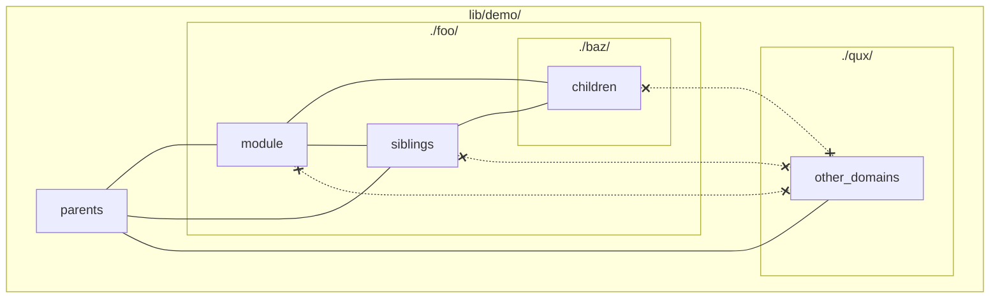

# Feder

Feder is a social journal where you can make private entries 
and selectively share them.

## Project structure

The modules are colocated within relevant domains. 

```diff
- lib/feder_web/
- test/
! lib/feder
! lib/feder/<domain>.ex
! lib/feder/<domain>/*.ex
+ lib/feder/<domain>/*.live.ex
+ lib/feder/<domain>/*.test.ex
```

Modules can reference all parents, children and siblings in 
the same directory. But cannot access other domains in 
parents' directories.



`config.exs` is renamed to remove repetition.

```diff
- config/config.exs
+ config/base.exs
```
